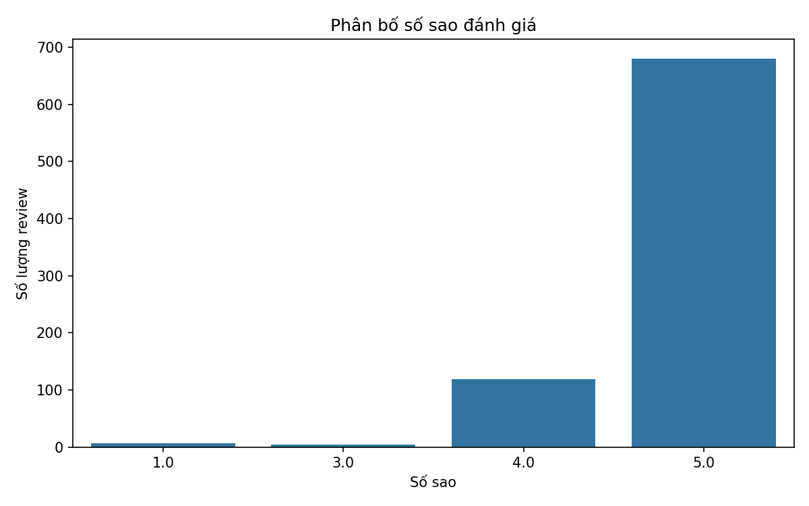
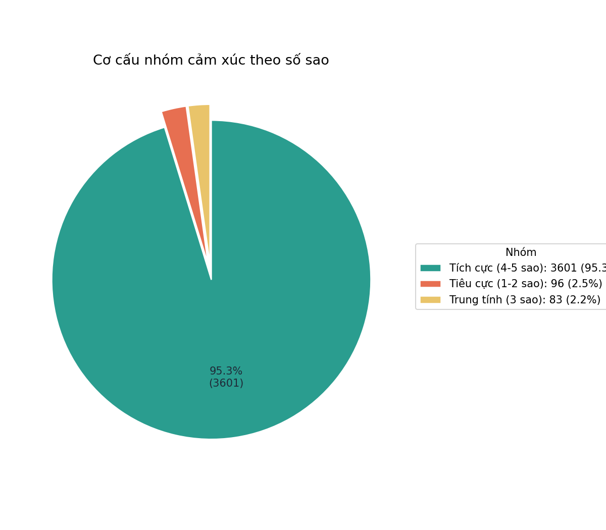
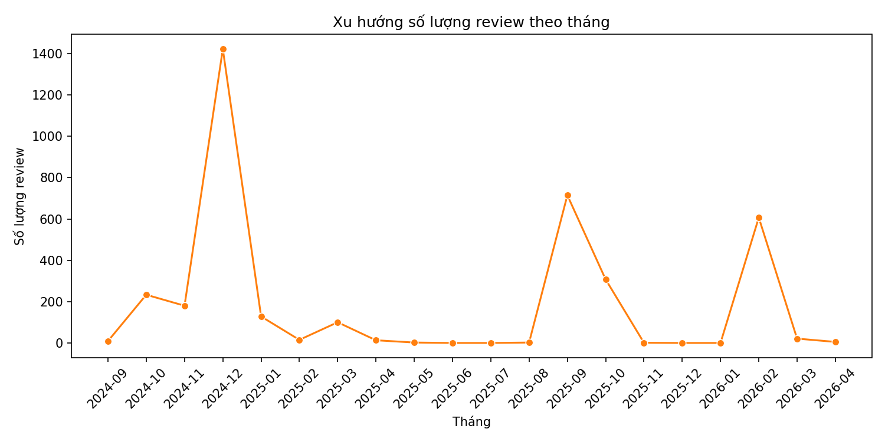
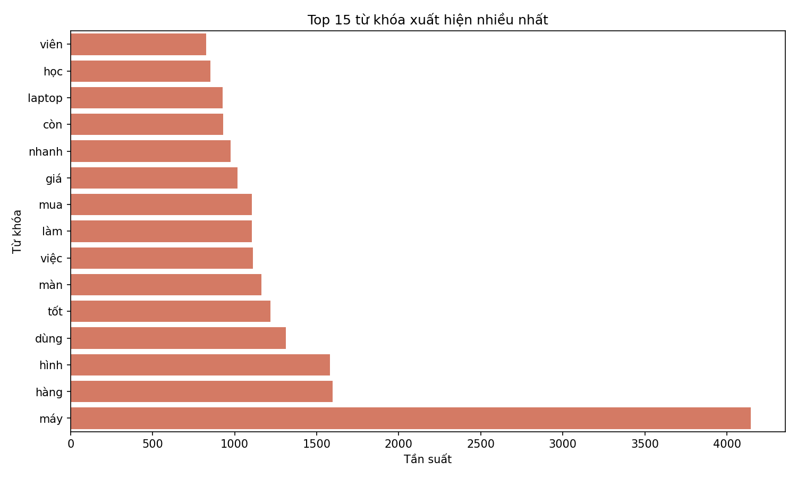
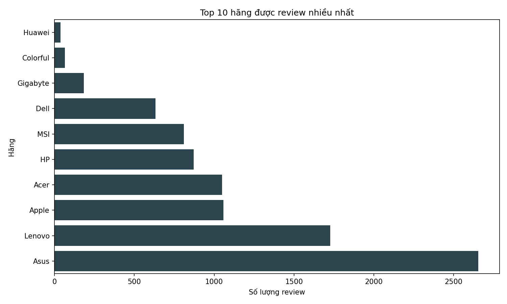
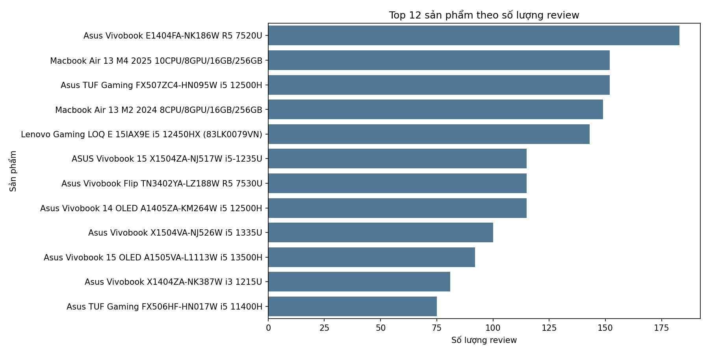
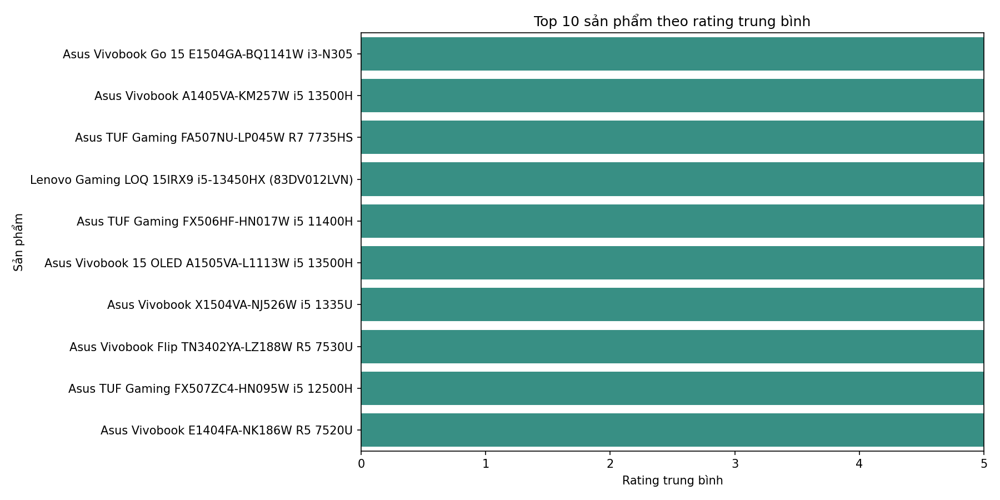

# Báo cáo đề tài: Phân Tích Ý Kiến Của Người Dùng Trên Tập Dữ Liệu Đánh Giá Sản Phẩm Laptop Trên FPTShop

## 1. Thông tin chung

- Tên đề tài: Phân tích ý kiến của người dùng trên tập dữ liệu đánh giá sản phẩm laptop trên FPTShop.
- Mục tiêu: Khai thác dữ liệu đánh giá để rút ra bức tranh tổng quan về mức độ hài lòng, xu hướng phản hồi theo thời gian, đặc điểm nội dung bình luận và mức độ tương tác phản hồi từ phía cửa hàng.
- Phạm vi: Phân tích mô tả và trực quan hóa dữ liệu; không sử dụng mô hình học máy.

## 2. Mô tả dữ liệu

### 2.1 Nguồn dữ liệu

- Dữ liệu được thu thập từ FPTShop qua luồng crawl HTTP và API comment có phân trang.
- Tệp dữ liệu thô: data/fptshop_laptop_raw.csv
- Tệp dữ liệu sạch: data/cleaned_reviews.csv

### 2.2 Quy mô dữ liệu

- Số dòng dữ liệu thô: 9.109
- Số dòng dữ liệu sau làm sạch: 9.108
- Tỷ lệ hao hụt sau làm sạch: 0,01% (chủ yếu do bình luận rỗng)

### 2.3 Các cột dữ liệu chính

- Thông tin đánh giá: review_id, user_id, rating_star, comment, review_title, created_at, like_count.
- Thông tin sản phẩm: item_id, product_name, brand, price, final_price, image_product.
- Tương tác phản hồi: reply_content, reply_created_at, reply_user_id, reply_is_admin, has_reply.

## 3. Quy trình xử lý và phân tích

### 3.1 Tiền xử lý dữ liệu

- Chuẩn hóa văn bản tiếng Việt: chuyển chữ thường, chuẩn hóa Unicode, loại bỏ URL và ký tự nhiễu.
- Loại bỏ bình luận rỗng sau chuẩn hóa.
- Khử trùng lặp theo review_id + comment_clean.
- Chuẩn hóa và kiểm tra hợp lệ cột rating_star.
- Tạo thêm đặc trưng review_len và cờ has_reply.

Kết quả bảng hao hụt: outputs/table_cleaning_steps.csv

### 3.2 Phân tích mô tả

- Thống kê tổng quan: outputs/eda_summary.csv
- Phân bố số sao: outputs/table_rating_distribution.csv và biểu đồ outputs/chart_rating_distribution.png
- Xu hướng theo tháng: outputs/table_monthly_trend.csv và biểu đồ outputs/chart_monthly_trend.png
- Độ dài bình luận theo số sao: outputs/table_review_len_by_rating.csv và biểu đồ outputs/chart_review_len_by_rating_boxplot.png
- Tần suất từ khóa: outputs/table_top_terms.csv và biểu đồ outputs/chart_top_terms.png
- Top hãng theo số review: outputs/table_top_brands_by_review.csv và biểu đồ outputs/chart_top_brands_by_review.png

### 3.3 Tổng hợp phục vụ báo cáo

- Nhóm cảm xúc theo sao: outputs/report/table_sentiment_groups.csv và outputs/report/chart_sentiment_groups_pie.png
- Top sản phẩm theo số review: outputs/table_top_products_by_review.csv và outputs/report/chart_top_items_by_review_count.png
- Top sản phẩm theo rating trung bình: outputs/report/table_top_products_by_rating.csv và outputs/report/chart_top_products_by_rating.png

## 4. Kết quả chính

### 4.1 Thống kê tổng quan

Từ outputs/eda_summary.csv:

- Tổng số review: 9.108
- Điểm sao trung bình: 4,737
- Trung vị điểm sao: 5
- Độ dài review trung bình: 78,79 ký tự
- Độ dài lớn nhất: 837 ký tự

Nhận xét:

- Dữ liệu cho thấy mức độ hài lòng cao, phân phối nghiêng mạnh về nhóm đánh giá tích cực.
- Nội dung review có biên độ độ dài khá rộng, phản ánh cả đánh giá ngắn và đánh giá chi tiết.

### 4.2 Phân bố số sao

Từ outputs/table_rating_distribution.csv (tập có rating hợp lệ):

- 1 sao: 86
- 2 sao: 10
- 3 sao: 83
- 4 sao: 454
- 5 sao: 3.147

Nhận xét:

- Nhóm 5 sao áp đảo hoàn toàn.
- Nhóm 1-2 sao chiếm tỷ trọng nhỏ, là vùng dữ liệu quan trọng để phân tích nguyên nhân chưa hài lòng.

### 4.3 Cơ cấu cảm xúc theo số sao

Từ outputs/report/table_sentiment_groups.csv:

- Tích cực (4-5 sao): 3.601 (95,26%)
- Tiêu cực (1-2 sao): 96 (2,54%)
- Trung tính (3 sao): 83 (2,20%)

Nhận xét:

- Phần lớn người dùng có trải nghiệm tốt hoặc rất tốt.
- Tỷ trọng tiêu cực thấp nhưng vẫn cần theo dõi theo từng nhóm sản phẩm để cải thiện dịch vụ.

### 4.4 Xu hướng số lượng review theo thời gian

- Giai đoạn dữ liệu: 2024-09 đến 2026-04.
- Tháng cao điểm: 2024-12 với 3.339 review.
- Tháng thấp điểm: 2024-09 với 17 review.

Nhận xét:

- Dữ liệu có tính mùa vụ rõ, xuất hiện các đợt tăng mạnh theo thời điểm mua sắm cao điểm.
- Cần kết hợp lịch chiến dịch khuyến mãi để giải thích biến động theo tháng chính xác hơn.

### 4.5 Đặc điểm nội dung bình luận

- Từ khóa xuất hiện nhiều: máy, hàng, hình, dùng, tốt, màn, việc, mua, làm, giá.
- Các từ khóa này cho thấy người dùng tập trung vào trải nghiệm sử dụng thực tế, chất lượng hiển thị và giá trị sử dụng.

### 4.6 Phân tích theo thương hiệu

Top hãng có nhiều review nhất:

- Asus: 2.654
- Lenovo: 1.727
- Apple: 1.059
- Acer: 1.049
- HP: 871

Nhận xét:

- Tập dữ liệu có độ bao phủ tốt trên nhiều hãng lớn, trong đó Asus và Lenovo chiếm ưu thế về số lượng đánh giá.
- Điều này phù hợp để triển khai phân tích so sánh theo hãng trong các bước mở rộng.

### 4.7 Mức độ phản hồi từ cửa hàng

- Số review có phản hồi từ shop/quản trị: 5.358
- Tỷ lệ phản hồi chung: 58,83%

Nhận xét:

- Mức phản hồi tương đối cao, cho thấy hoạt động chăm sóc khách hàng có hiện diện đáng kể.
- Tuy nhiên vẫn có nhóm sản phẩm tỷ lệ phản hồi thấp, cần ưu tiên tối ưu quy trình phản hồi sau bán.

Dữ liệu chi tiết: outputs/table_reply_rate_extremes.csv

### 4.8 Top sản phẩm nổi bật

Theo số lượng review cao:

- Asus Vivobook E1404FA-NK186W R5 7520U: 183 review
- Macbook Air 13 M4 2025: 152 review
- Asus TUF Gaming FX507ZC4-HN095W i5 12500H: 152 review

Theo rating trung bình cao (lọc ngưỡng số review):

- Nhóm top chủ yếu đạt trung bình 5,0 sao.
- Nhiều sản phẩm thuộc dòng Asus Vivobook/TUF và Lenovo LOQ.

Hình minh họa:

## 5. Kết luận

- Dữ liệu đánh giá laptop trên FPTShop thể hiện xu hướng tích cực rõ rệt với tỷ lệ cao ở mức 4-5 sao.
- Người dùng quan tâm nhiều đến chất lượng sử dụng thực tế, màn hình, hiệu năng và giá.
- Hệ thống phản hồi của cửa hàng ở mức khá tốt nhưng chưa đồng đều giữa các sản phẩm.
- Các kết quả hiện tại đủ cơ sở để hỗ trợ phần nhận định thị trường và đề xuất cải thiện dịch vụ trong báo cáo môn học.

## 6. Hạn chế và hướng phát triển

### 6.1 Hạn chế

- Dữ liệu tập trung vào một nguồn (FPTShop), chưa đại diện toàn bộ thị trường.
- Tỷ lệ 5 sao cao có thể tạo thiên lệch khi suy luận mức độ hài lòng chung.
- Phân tích hiện tại chủ yếu là mô tả, chưa đi sâu mô hình dự báo/phân loại.

### 6.2 Hướng phát triển

- Mở rộng nguồn dữ liệu (nhiều sàn/website bán lẻ).
- Bổ sung phân tích theo phân khúc giá, thời gian ra mắt, nhóm cấu hình.
- Thử nghiệm phân tích cảm xúc mức văn bản và trích xuất chủ đề tự động.
- Xây dựng dashboard tương tác để theo dõi KPI đánh giá theo thời gian thực.

## 7. Phụ lục tệp đầu ra

- Tổng quan EDA: outputs/eda_summary.csv
- Hao hụt dữ liệu: outputs/table_cleaning_steps.csv
- Phân bố sao: outputs/table_rating_distribution.csv
- Xu hướng tháng: outputs/table_monthly_trend.csv
- Độ dài review theo sao: outputs/table_review_len_by_rating.csv
- Top hãng: outputs/table_top_brands_by_review.csv
- Top từ khóa: outputs/table_top_terms.csv
- Nhóm cảm xúc: outputs/report/table_sentiment_groups.csv
- Top sản phẩm theo review: outputs/table_top_products_by_review.csv
- Top sản phẩm theo rating: outputs/report/table_top_products_by_rating.csv
