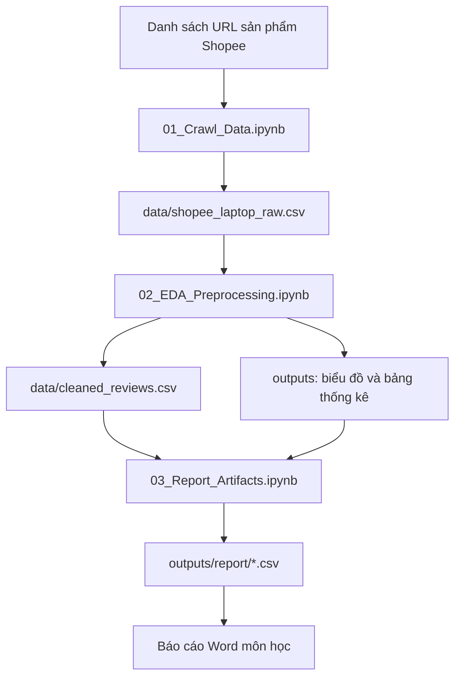
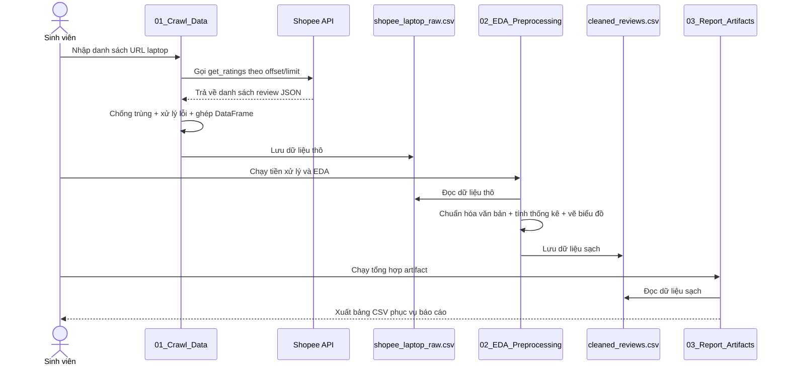
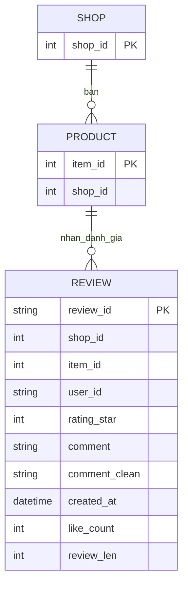

# Kiến trúc dự án phân tích dữ liệu đánh giá laptop Shopee

## 1. Tổng quan hệ thống (System Overview)

Hệ thống được xây dựng để thu thập, làm sạch và phân tích dữ liệu đánh giá sản phẩm laptop trên Shopee. Mục tiêu chính là rút ra các insight mô tả về hành vi đánh giá của người dùng như phân bố số sao, xu hướng thời gian và từ khóa nổi bật trong bình luận.

## 2. Công nghệ sử dụng (Tech Stack)

- Python 3
- Jupyter Notebook (.ipynb)
- Requests: gửi HTTP request để lấy dữ liệu đánh giá
- Pandas: xử lý dữ liệu dạng bảng
- Matplotlib, Seaborn: trực quan hóa dữ liệu
- Regex, Unicodedata: chuẩn hóa văn bản tiếng Việt

## 3. Cấu trúc thư mục (Folder Structure)

```text
.
├─ 01_Crawl_Data.ipynb              # Thu thập dữ liệu review từ Shopee
├─ 02_EDA_Preprocessing.ipynb       # Làm sạch và phân tích mô tả
├─ 03_Report_Artifacts.ipynb        # Tổng hợp bảng biểu cho báo cáo
├─ data/
│  ├─ shopee_laptop_raw.csv         # Dữ liệu thô
│  └─ cleaned_reviews.csv           # Dữ liệu đã làm sạch
├─ outputs/
│  ├─ eda_summary.csv               # Bảng thống kê tổng quan
│  ├─ chart_rating_distribution.png # Biểu đồ phân bố sao
│  ├─ chart_monthly_trend.png       # Biểu đồ xu hướng theo tháng
│  └─ report/                       # Bảng biểu đầu ra phục vụ báo cáo
└─ docs/
   ├─ architecture.md
   └─ CHANGELOG.md
```

## 4. Kiến trúc thành phần (Component Architecture)

- Thành phần Thu thập dữ liệu: gọi API đánh giá sản phẩm từ Shopee theo từng sản phẩm.
- Thành phần Tiền xử lý: chuẩn hóa văn bản, xử lý thiếu dữ liệu, loại trùng và chuẩn hóa kiểu dữ liệu.
- Thành phần Phân tích mô tả: tính thống kê cơ bản, tạo biểu đồ phân bố và xu hướng.
- Thành phần Báo cáo: tổng hợp bảng biểu ra CSV để chèn vào báo cáo Word.

## 5. Luồng dữ liệu (Data Flow)

1. Người dùng cung cấp danh sách URL sản phẩm laptop Shopee.
2. Notebook thu thập gọi API theo phân trang và lưu dữ liệu thô vào CSV.
3. Notebook tiền xử lý đọc CSV thô, làm sạch văn bản và tạo dữ liệu sạch.
4. Hệ thống phân tích dữ liệu sạch để tạo bảng thống kê và biểu đồ.
5. Notebook tổng hợp xuất các bảng cuối cùng cho phần phụ lục báo cáo.

## 6. Cơ chế bảo mật (Security Mechanisms)

- Không lưu thông tin nhạy cảm (mật khẩu, token cá nhân) trong mã nguồn.
- Tôn trọng giới hạn truy cập bằng cách thêm độ trễ giữa các request.
- Xử lý lỗi request và dừng an toàn khi gặp lỗi liên tiếp để tránh gây tải bất thường.

## 7. APIs / Routes cốt lõi (Core APIs/Routes)

- Shopee ratings API:
  - Endpoint: `https://shopee.vn/api/v2/item/get_ratings`
  - Tham số chính: `shopid`, `itemid`, `offset`, `limit`, `filter`, `type`
- Tệp đầu ra lõi:
  - `data/shopee_laptop_raw.csv`
  - `data/cleaned_reviews.csv`
  - `outputs/eda_summary.csv`

## 8. Sơ đồ trực quan (Visual Diagrams - Mermaid.js)






