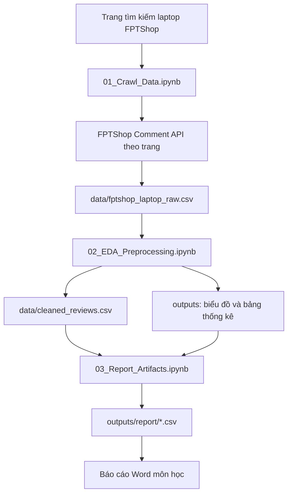
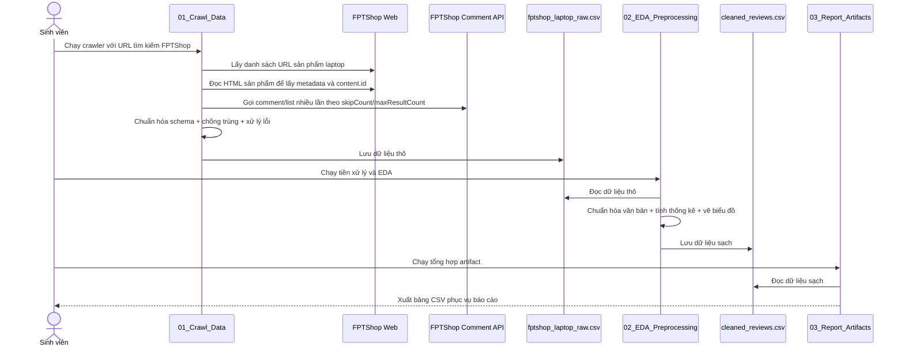
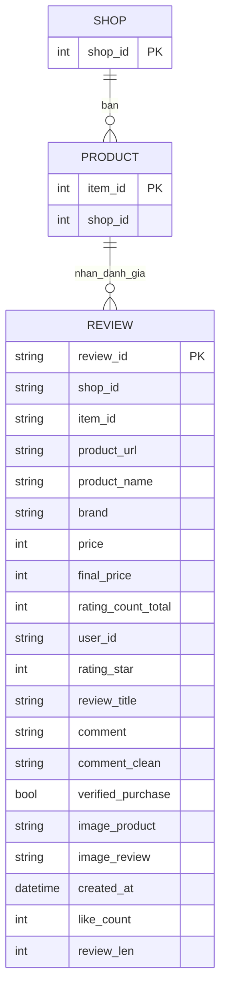

# Kiến trúc dự án phân tích dữ liệu đánh giá laptop FPTShop

## 1. Tổng quan hệ thống (System Overview)

Hệ thống được xây dựng để thu thập, làm sạch và phân tích dữ liệu đánh giá sản phẩm laptop trên FPTShop. Phần crawl hiện lấy comment qua API riêng của FPTShop, đi qua nhiều trang bình luận, lưu thêm `product_url` của từng sản phẩm và phản ánh đầy đủ hơn hành vi đánh giá của người dùng cũng như phản hồi của quản trị viên khi có.

## 2. Công nghệ sử dụng (Tech Stack)

- Python 3
- Jupyter Notebook (.ipynb)
- Requests: gửi HTTP request để lấy danh sách sản phẩm và dữ liệu đánh giá qua API comment có phân trang
- Pandas: xử lý dữ liệu dạng bảng
- Matplotlib, Seaborn: trực quan hóa dữ liệu
- Regex, Unicodedata: chuẩn hóa văn bản tiếng Việt

## 3. Cấu trúc thư mục (Folder Structure)

```text
.
├─ 01_Crawl_Data.ipynb              # Thu thập dữ liệu review từ FPTShop
├─ 02_EDA_Preprocessing.ipynb       # Làm sạch và phân tích mô tả
├─ 03_Report_Artifacts.ipynb        # Tổng hợp bảng biểu cho báo cáo
├─ data/
│  ├─ fptshop_laptop_raw.csv        # Dữ liệu thô
│  └─ cleaned_reviews.csv           # Dữ liệu đã làm sạch
├─ outputs/
│  ├─ eda_summary.csv               # Bảng thống kê tổng quan
│  ├─ chart_rating_distribution.png # Biểu đồ phân bố sao
│  ├─ chart_monthly_trend.png       # Biểu đồ xu hướng theo tháng
│  └─ report/                       # Bảng biểu đầu ra phục vụ báo cáo
└─ docs/
   ├─ architecture.md
   └─ CHANGELOG.md
```

## 4. Kiến trúc thành phần (Component Architecture)

- Thành phần Thu thập dữ liệu: thu URL sản phẩm laptop từ trang tìm kiếm FPTShop, sau đó gọi API comment của từng sản phẩm theo `skipCount`/`maxResultCount` để lấy nhiều trang phản hồi, đồng thời trích metadata sản phẩm (tên, hãng, giá, ảnh, tổng lượt đánh giá).
- Thành phần Tiền xử lý: chuẩn hóa văn bản, xử lý thiếu dữ liệu, loại trùng và chuẩn hóa kiểu dữ liệu; review thiếu `rating_star` được giữ lại trong dữ liệu sạch để phục vụ các phân tích sau.
- Thành phần Phân tích mô tả: tính thống kê cơ bản, tạo biểu đồ phân bố và xu hướng.
- Thành phần Báo cáo: tổng hợp bảng biểu ra CSV để chèn vào báo cáo Word.

## 5. Luồng dữ liệu (Data Flow)

1. Notebook thu thập gọi trang tìm kiếm FPTShop để lấy danh sách URL sản phẩm laptop.
2. Notebook gọi API comment của từng sản phẩm theo nhiều trang, trích metadata sản phẩm/review, giữ `product_url` trong từng dòng và đồng thời giữ lại phản hồi của quản trị viên nếu có, rồi lưu dữ liệu thô vào CSV.
3. Notebook tiền xử lý đọc CSV thô, làm sạch văn bản, giữ các review thiếu `rating_star` và chỉ loại các giá trị rating hỏng hoặc ngoài khoảng hợp lệ trước khi tạo dữ liệu sạch.
4. Hệ thống phân tích dữ liệu sạch để tạo bảng thống kê và biểu đồ.
5. Notebook tổng hợp xuất các bảng cuối cùng cho phần phụ lục báo cáo.

## 6. Cơ chế bảo mật (Security Mechanisms)

- Không lưu thông tin nhạy cảm (mật khẩu, token cá nhân) trong mã nguồn.
- Tôn trọng giới hạn truy cập bằng cách thêm độ trễ giữa các request.
- Xử lý lỗi request và dừng an toàn khi gặp lỗi liên tiếp để tránh gây tải bất thường.

## 7. APIs / Routes cốt lõi (Core APIs/Routes)

- FPTShop Search URL:
  - Endpoint: `https://fptshop.com.vn/tim-kiem?s=laptop&sort=noi-bat&categories=may-tinh-xach-tay`
  - Dùng để thu thập URL sản phẩm laptop theo trang (`page`)
- FPTShop Product Page:
  - Endpoint: `https://fptshop.com.vn/may-tinh-xach-tay/...`
  - Dùng để trích xuất dữ liệu đánh giá hiển thị trong HTML
- FPTShop Comment API:
  - Endpoint: `https://papi.fptshop.com.vn/gw/v1/public/bff-before-order/comment/list`
  - Dùng để lấy comment theo phân trang với `content.id`, `skipCount`, `maxResultCount` và `sortMethod`
- Tệp đầu ra lõi:
  - `data/fptshop_laptop_raw.csv`
  - `data/cleaned_reviews.csv`
  - `outputs/eda_summary.csv`

## 8. Sơ đồ trực quan (Visual Diagrams - Mermaid.js)






